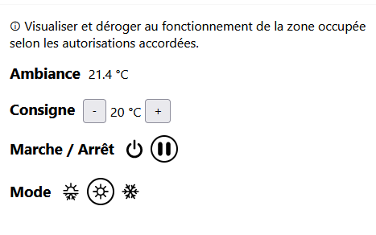

# Melzone Building for Home Assistant

The `melzone_building` integration integrates Mitsubishi Electric's Melzone Building devices into Home Assistant. It leverages the Colibri virtual remote control API.

## Features

- Integrates Colibri virtual remote control API
  - Auto discovery of enabled features not supported
- Provides `climate` and `sensor` platforms.

### Climate

The following parameters can be controlled for the `climate` platform entities:

- Power (using HVAC mode)
- Target temperature
- Operation mode (HVAC mode)

### Sensor

The following attributes are available for `sensor` platform entities:

- Room temperature
- Target temperature

## Configuration

After installing Auto Backup via [HACS](https://hacs.xyz/), it can then be setup via the UI, by going to **Configuration** → **Devices & Services** → **Add Integration** → **Melzone Building** or by clicking the button below.

